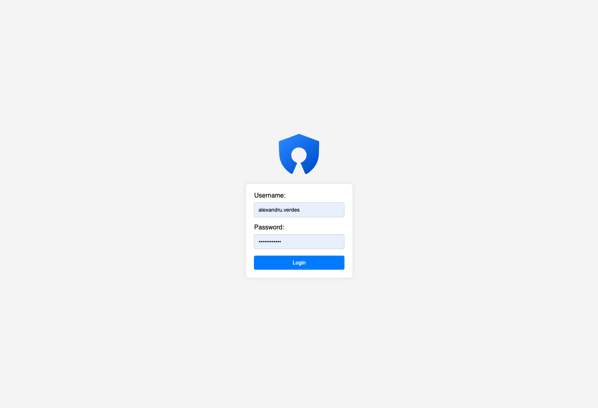
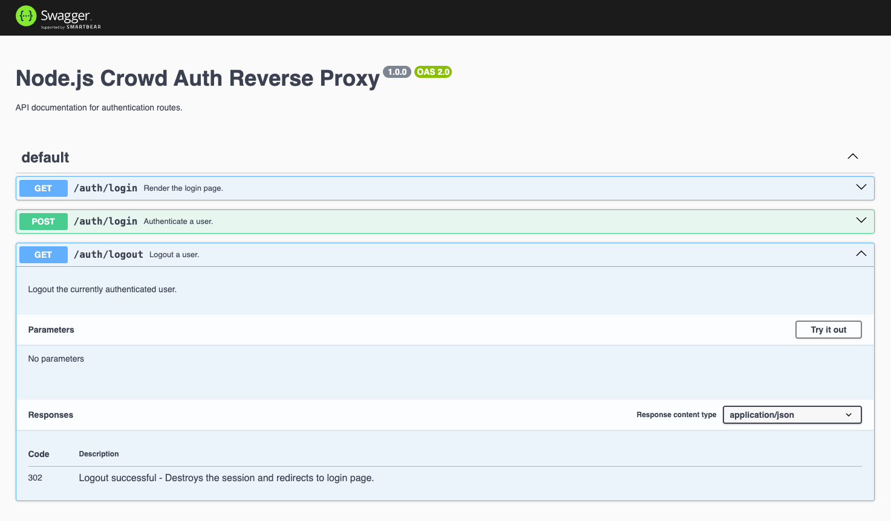

# N-CARP 🎏 (nodejs-crowd-auth-reverse-proxy)
This Node.js (typescript version) project serves as a reverse proxy that handles authentication through our Crowd Gateway. It provides session management using SQLite and implements JWT logic for secure token handling.

## Table of Contents

- [Introduction](#introduction)
- [Features](#features)
- [Requirements](#requirements)
- [Installation](#installation)
- [Usage](#usage)
- [Configuration](#configuration)
- [Roadmap](#roadmap)
- [Status](#status)

## Introduction

Node.js Crowd Auth Reverse Proxy is designed to simplify the authentication process for your applications by acting as a reverse proxy that interfaces with the Crowd Gateway. 
It ensures secure session management and uses JWT logic for token handling. It supports configurations for a frontend client-facing app and an API.
Note: The login interface is managed within the proxy with ejs templates.

## Features

- **Reverse Proxy:** Efficiently redirects requests to the client app(s).
- **Authentication through Crowd Gateway:** Seamless integration with Crowd for user authentication.
- **Session Management with SQLite:** Persists user sessions using SQLite for reliability.
- **JWT Logic for Token Handling:** Implements JSON Web Tokens for secure and stateless token management.
- **Redirect to Client App upon Login:** Ensures a smooth user experience by redirecting authenticated users to the client app.
- **Proxies requests to the API client** No more pesky CORS headers to set.

## Requirements

- Node.js (>= 18.18.2)
- nvm (>=0.1.0)

## Installation

Clone the repository:

```bash
git clone https://gitlab.esolutions.ro/frontend/nodejs-crowd-auth-reverse-proxy.git
```

Install and run:

```bash
cd nodejs-crowd-auth-reverse-proxy
npm install
nvm use
npm run dev
```

## Configuration

Create a `.env` file with the following fields
```dotenv
PORT
CROWD_AUTH_URL
CROWD_USER_LIST_URL
CROWD_USER
CROWD_PASSWORD
JWT_SECRET
APP_URL
API_URL
SQL_DB_FILE
TOKEN_EXPIRATION
```

A few fields have default values, but it's best to set them anyway. 
Here's a list of values with their defaults:

- `PORT:3000`
- `TOKEN_EXPIRATION:1d`
- `JWT_SECRET:somerandomstring`

The `APP_URL` and `API_URL` are the apps you want behind the authentication gateway / reverse-proxy. 
Upon successful authentication you will automatically get redirected to `/app`. As for the `api` all routes sit under the `/api`
route, which you can call in your frontend app (from your `APP_URL`).

You can find an example config in the `.env.example` file in the root folder. Here are the contents:

```dotenv
PORT=3000
CROWD_AUTH_URL=https://crowd.esolutions.ro/crowd/rest/usermanagement/1/authentication?username=
CROWD_USER_LIST_URL=https://crowd.esolutions.ro/crowd/rest/usermanagement/1/group/user/direct?groupname=esolutions-employee
CROWD_USER=
CROWD_PASSWORD=
JWT_SECRET=NB0116BAVAJisv7MD0AYQA==
APP_URL=http://localhost:5173
API_URL=http://localhost:8055
SQL_DB_FILE=./db/database.db
TOKEN_EXPIRATION=1d
```

For security reasons, the `CROWD_APP` and `CROWD_PASSWORD` are not included in this example.

### Database setup

If you get any errors from the Sqlite instance not being able to write to `db/database.db` the easiest solution
is to just create an empty file called `database.db` in that location. The folder is included in this repo but 
for obvious reasons the file is not, to prevent conflicts.

## Usage
After the initial setup stages just run `npm run dev` in our console. You should be able to access the app from
`http://localhost:3000/` if you did not change the `PORT`. 



If a session cookie already exists then you will
automatically be redirected to `/app`. Otherwise, you will be taken to `/auth/login`. All authentication logic
sits under `/auth` routes. Available routes are:
- `/auth/login` (GET)
- `/auth/login` (POST)
- `/auth/logout` (GET) ## you can set this in your frontend app in a link (`<a href="/auth/logout">LOGOUT</a>`)
- `auth/user-info` (GET) // get the current user session info
- `auth/user-list` (GET) // get a list of all active esol employees

**SWAGGER** : Swagger is available and you can get more details on the routes in the dedicated route: `/swagger`



All `API` routes from the frontend go through the reverse-proxy to avoid unnecessary CORS headers and policies.
To access any of the routes available in your API app just use the `/api` route. For example, if you have
defined a route in your API that looks like this `http://localhost:8055/items/apps` you would call it in your
frontend app like this `/api/items/apps`

**NOTE**: In your frontend app you will have to set your base to `/app`. Here's an example Vite React config:
```javascript
import { defineConfig } from 'vite'
import react from '@vitejs/plugin-react'

// https://vitejs.dev/config/
export default defineConfig({
  plugins: [react()],
  base: '/app', // Specify the base path for your app
  build: {
    outDir: 'dist', // Specify your output directory
  },
})
```

## Roadmap
There are a few idea brewing and a few possible features in the future, such as:
- adding support for cronjob operations
- adding support and ready-made configurations for docker
- adding support for multiple apps (proxy as many as you want)
- setup demo page/project with CI/CD pipeline

## Status
This project is in its birthing stages, so expect new and exciting things coming soon.
